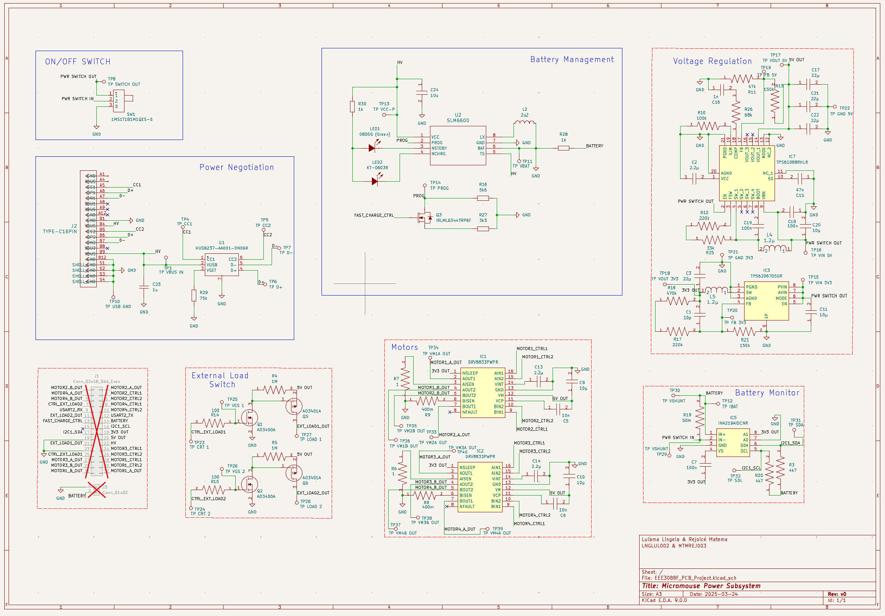
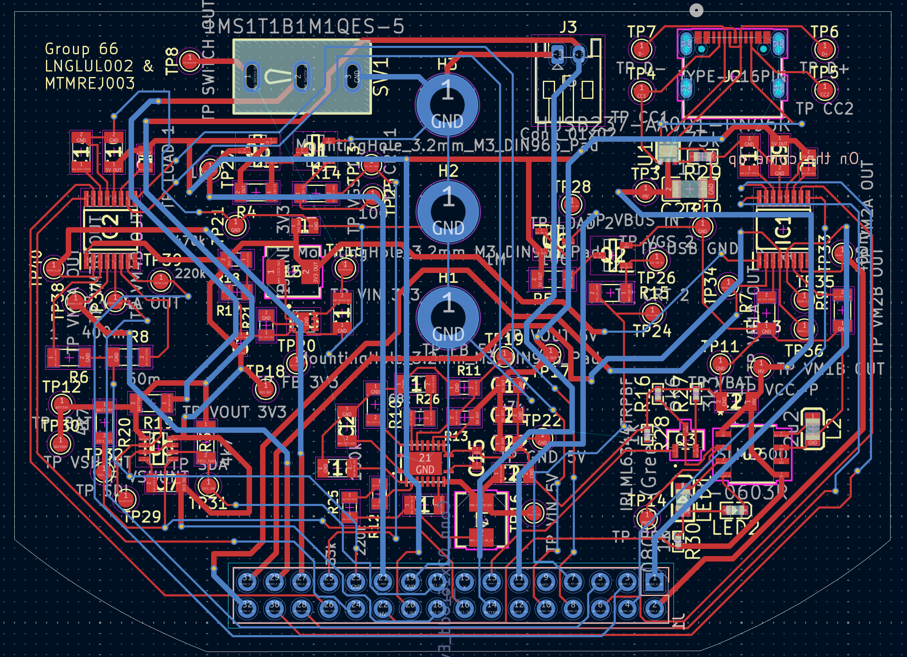
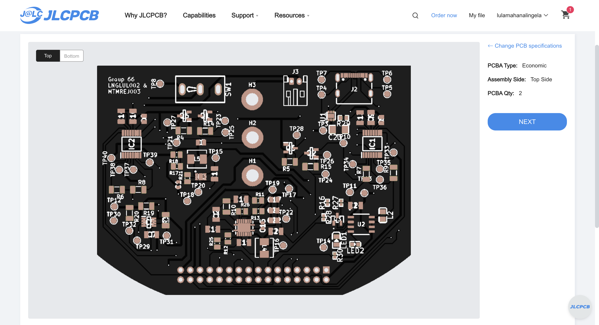
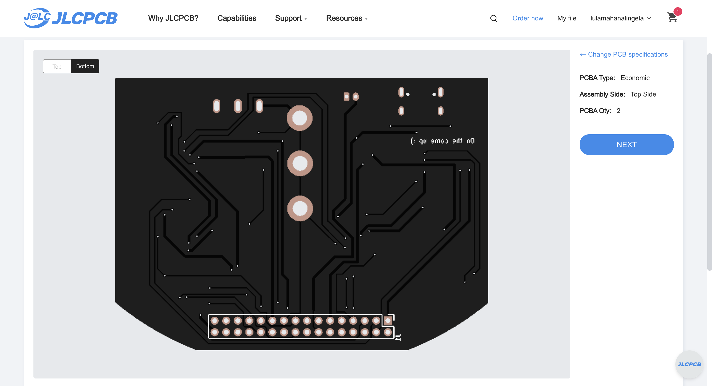

# 🐭 Micromouse Power Subsystem – EEE3088F 2025

> A modular and cost-efficient power subsystem designed for the Micromouse platform, focusing on power delivery, battery management, voltage regulation, and motor control.  
> 🔧 Built to integrate with a shared motherboard using a 2×16 pin header.

---

## 📐 Design Requirements

- Must interface with **shared motherboard via 2×16 pin header**
- All subsystems must **interoperate safely and reliably**
- Total cost must not exceed **$28.25 per student**
- Designed with **PCB production in mind** (JLCPCB compatible)

---

## ⚡ Subsystems Overview

### 1. USB-C Power Input
- **Objective**: Extract and regulate power from USB-C
- **Default Output**: 5V  
- **Target Output**: 9V
- **Approaches**:
  - Step-up converter (boost from 5V)
  - Request 9V from port using USB PD (Power Delivery) negotiation

### 2. Battery Management
- **Battery**: 3.7V 800mAh LiPo (used in micro robotics)
- **Charging Input**: 9V (from USB-C)
- **Charging Modes**:
  - Low current: **200mA**
  - High current: **(600 ± 100)mA**
- **Key Considerations**:
  - LiPo is **sensitive to overcharging**
- **Design Strategies**:
  - Use a **battery management IC**
  - Dual-mode charging circuit (selectable)
    - Separate high- and low-current paths
  - OR: Current regulation on USB-C input side that supports both modes

### 3. Power Switching & Regulation

#### 🔌 Power Switch
- Enables/disables battery output to downstream circuits

#### 🔋 Voltage Regulation
- Battery output can supply up to **400mA**
- **Approach**: Efficient voltage regulation using buck converters
- **Protection**: Optional current amplification for regulated rails

#### 🔀 External Load Switching
- Must control **2 external loads**, each up to **1A**
- **Solution**: High-current **MOSFET switching circuits**
- Current path design considers **external load values**

### 4. Components & Motor Drivers

#### 🔍 Current Sensor
- **INA219** or similar  
- Connects via **I²C**  
- Placed on high-side battery line for real-time monitoring

#### 🚗 Motor Control
- **Primary Motors**: 2 × 200mA  
- **Auxiliary Motors**: 2 × 500mA  
- Control via **dual H-bridge** motor driver (e.g., DRV8833)
- Motors driven bidirectionally using **PWM from MCU**

---

## 🧰 Production & Submission Instructions (EEE3088F)

The final PCB submission is in a zipped folder:
[Final PCB Files](./EEE3088F_PCB_Project/jlcpcb/production_files/EEE3088F_2025_Project_PCB_Files_Group_66_LNGLUL002_MTMREJ003.zip)

_Including:_
1. Zipped **Gerber** files (with silkscreen including group & student numbers)
2. **BOM `.csv`** file  
3. **POS/CPL `.csv`** file  
4. Screenshot of **JLCPCB BOM upload** page  
5. Screenshot of **JLCPCB Add to Cart** confirmation page  

📷 PCB Design:
- Schematic

- PCB Wiring

- JLCPCB Design (Front)

- JLCPCB Design (Back)

  
---

## 👨‍💻 Authors: Group 66

- **Lulama Lingela** (LNGLUL002)
- **Rejoice Matema** (MTMREJ003)
